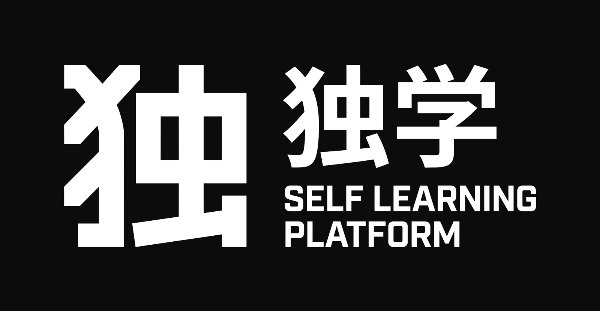

<div align="center">

<!-- omit in toc -->



**an agent-powered hub for self-learners**

[](https://selflearningplatform.github.io)
[](https://github.com/GustavoPenaBeltrami/self-learning-platform/stargazers)
[](https://github.com/GustavoPenaBeltrami/self-learning-platform/issues)
[](https://www.python.org/)
[](#installation)

<sub>made by [Gustavo Peña Beltrami](https://github.com/GustavoPenaBeltrami)</sub>

</div>

## Repository description

Four pieces that talk to each other through the filesystem:

| Path | Piece | Role |
|---|---|---|
| `agent/skills/` | skills | The method: teach, build exams and exercises, grade against a rubric, review with Leitner |
| `agent/agents/` | agents | A `researcher` that verifies before stating anything, and a `teacher-<slug>` per topic |
| `topics/<slug>/` | filesystem | Notes in Markdown, exams in JSON, attempts, grading and progress. No database |
| `app/` | app | Local notebook and exam simulator, with dictation (Whisper), Mermaid and LaTeX |

The **filesystem** reads fine on GitHub, in Obsidian or in any editor. `topics/example/` shows the structure; your real topics stay out of git.

## Getting started

### Installation

#### Requirements

- **[uv](https://docs.astral.sh/uv/)**: The only thing you need to install.

  ```sh
  curl -LsSf https://astral.sh/uv/install.sh | sh # macOS and Linux
  ```
    ```sh
  powershell -ExecutionPolicy ByPass -c "irm https://astral.sh/uv/install.ps1 | iex" # Windows
  ```
- **A coding agent**, whichever you use. It has to have permission in the folder of the repo. We recommend claude code.
- **Internet for the first `uv run slp`**, which downloads the packages. After that it aims to work offline: Mermaid, KaTeX and the fonts ship in the repo (`app/vendor/`).

#### Steps

```sh
git clone https://github.com/GustavoPenaBeltrami/self-learning-platform.git
cd self-learning-platform
```

Add `uv run slp setup` here if you want [dictation](#notes-dictator-support-optional) ready offline.

Open your agent in the folder and run this prompt:

```
Read AGENTS.md and run slp-setup.
```

It detects which agent it is and exposes the skills in that agent's format: symlinks if it supports them, conversion if not. Whatever it creates goes to `.git/info/exclude`, so it doesn't clutter the repo. Then start the app:

```sh
uv run slp
```

**Going to keep your topics in your own repo?** Change the remote:

```sh
git remote set-url origin <your-repo>
```

#### Note's dictator support (optional)

Speak instead of type: dictate notes, or answer oral exam questions out loud. It runs locally with Whisper. Without it, the mic falls back to your OS dictation.

<details>
<summary>Engines, models and setup</summary>

| System | Engine | Disk | Start with |
|---|---|---|---|
| macOS Apple Silicon | mlx-whisper (GPU) | ~2.7 GB | `uv run slp` |
| macOS Intel, Linux x64, Windows x64 | faster-whisper (CPU) | ~0.7 GB | `uv run slp` |
| Windows ARM | faster-whisper, emulated x64 Python | ~0.7 GB | `uv run --python cpython-3.12-windows-x86_64-none slp` |

- **Model**: `small` by default on CPU, `turbo` (~1.6 GB) is more accurate. Change it in `/settings`.
- **Offline**: `uv run slp setup` downloads the model ahead of time. Pick a profile: `auto` (default, downloads on first mic use), `online` (turbo) or `offline` (pick a size, a local model path, or none).
- **Oral exams**: the audio is saved next to the attempt, and the agent transcribes it with `uv run slp transcribe` to grade the content, not pronunciation.

</details>

### First setup

Once `/slp-setup` is done, create your first **topic**: a book, a certification, a paper, a course. Anything you study, organized the way you want. Run `/slp-init` and the agent asks what it needs to set it up.

#### A topic on disk

Everything about a topic lives in one folder, as Markdown and JSON:

```
topics/<slug>/
├── topic.json                  # title, goals, languages, sources, routine
├── learning.md                 # what you've shown you know, and what you got wrong
├── resources/                  # your material: PDFs, slides, transcripts
├── notes/
│   └── 01-<chapter>.md         # summaries, lessons and your own notes
├── exams/
│   └── <exam>/
│       ├── exam.json           # questions and rubric
│       └── attempts/
│           ├── <date>.json     # your answers
│           ├── <date>-p3.webm  # audio of an oral answer
│           └── <date>.md       # the grade and feedback
├── exercises/
│   └── <exercise>/
│       ├── prompt.md
│       └── attempts/<date>.<ext>
└── progress/
    ├── status.md               # where you are
    └── log.md                  # session history
```

`topics/example/` is a small one to look at. Your own topics are git-ignored.

#### Language

`topic.json` → `language` sets the defaults: `source` is the material's language, `notes` for notes, summaries and lessons, `exams` for exams, exercises and feedback. Ask for another language in any single request ("give me the exam in English") without touching the file. The agent chats in whatever language you write in.

### Studying loop

| Command | Step | What it does |
|---|---|---|
| `/slp-session` | plan | What's pending today across every topic, and what to do |
| `/slp-summarize` | prepare | Summarizes material into the topic's notes |
| `/slp-teach` | prepare | Teaches until it's understood, not memorized |
| `/slp-exercises` | practice | An applied exercise: code, an ADR, a critique |
| `/slp-exam` | practice | Builds an exam you sit in the app |
| `/slp-grade` | feedback | Grades the attempt against a rubric |
| `/slp-review` | review | Spaced, interleaved Leitner review so it doesn't fade |

Everything they produce lands in the topic folder and shows up in the app on its own.

### Recommended setup

Three windows side by side. Two monitors help.

| # | Window | Use |
|---|---|---|
| 1 | **material** | The PDF, the course, the docs. Whatever you're studying |
| 2 | **app** | `uv run slp` in the browser: notes, exams, progress |
| 3 | **agent** | Open at the repo root. Teaches, builds exams, grades |

## Project identity

### Name

独学 (*dokugaku*) is the Japanese word for self-study. SLP, the Self Learning Platform, is built for exactly that: one person, one topic, and the discipline to keep going. The agent teaches, quizzes and grades. The learning stays yours.

<table align="center">
  <tr>
    <td><h1 align="center">独</h1><b>doku</b> · by oneself</td>
    <td><h1 align="center">学</h1>gaku</b> · learning</td>
  </tr>
</table>

A book, a certification, a tool's documentation, a course: everything you study is a **topic**, and SLP builds the full loop around it (preparation, practice, feedback, spaced review). Everything stays as Markdown and JSON on your disk. No database, no account. It all starts with one line in your agent:

### Why

Studying well is harder than it looks. Reading isn't enough: you need someone to explain, quiz you, grade you and make you review right before you forget. SLP takes care of all of that. You study the material, the agent teaches and grades, and everything stays on your disk: **the method comes built in.**

**It doesn't depend on any particular agent.** The skills use the `SKILL.md` format and `AGENTS.md` explains the project to any of them: Claude Code, Codex, Gemini CLI, Antigravity, Cline, Cursor, opencode, with a cloud model or a local one via Ollama.

### Principles

Four Japanese design ideas describe what SLP does. They settle decisions; they are not decoration.

| | Idea | Meaning | In SLP |
|---|---|---|---|
| 簡素 | **kanso** | simplicity | one font, no shadows, no gradients |
| 間 | **ma** | negative space | the `~` buffer, the space around the mark |
| 渋い | **shibui** | quiet beauty | hierarchy by lightness, not size |
| 静寂 | **seijaku** | calm | chrome lives in two bars; content stays quiet |

Two themes, ink and paper: `sumi` 墨 and `kami` 紙. The full design reference is [`app/styles/DESIGN.md`](app/styles/DESIGN.md).

## documentation

**Online or offline?** The online profile (a paid agent) is recommended. To run everything on your machine, use opencode + Ollama + `qwen3-coder:30b` (or `gpt-oss:20b` on 16 GB of RAM).

**Roadmap:** test `slp-setup-agent` on Codex, Gemini CLI, Antigravity and Cline, and native dictation on Windows ARM. See the [open issues](https://github.com/GustavoPenaBeltrami/self-learning-platform/issues).

**Thanks to** [amosblomqvist/learn](https://github.com/amosblomqvist/learn) for the method behind `slp-teach` and to [Matt Pocock](https://github.com/mattpocock) for per-topic memory and spaced review.

## contributing

Contributions are welcome. Fork the repo, create your branch, and open a pull request. Skills are edited in `agent/skills/`, never inside an agent's own folder. For bugs or ideas, [open an issue](https://github.com/GustavoPenaBeltrami/self-learning-platform/issues/new).

## license

[MIT](LICENSE).
