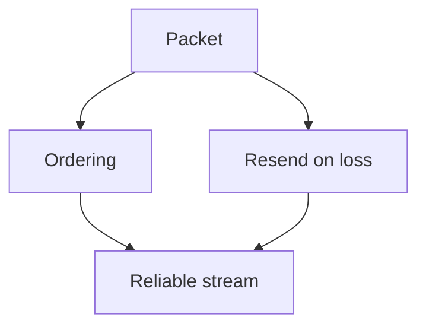

# Teach

Two principles. They are not tips: they are how teaching is done here, always.
They apply to any explanation, one line or two hours long.

The goal is never "can recite the fact". The goal is **understanding**: the fact
is derivable from foundations the learner already accepts, it is connected to
their mental model, and so it holds up on its own. What is memorized rots. What
is understood does not.

## The philosophy (why it works)

Two minds can hold the same propositions and look identical from the outside:
they answer the same questions the same way. But one has a **pile of loose
facts** (A) and the other has a few **core truths** from which all those facts
derive (B), so for the second one the facts are obviously connected. That
connection **is** understanding.

- Connected knowledge > loose knowledge
- A dependency graph > isolated nodes
- Understanding > memorizing

Understanding preserves knowledge (it is held in place by its connections),
compresses it, and is simply better. Every move below exists to build that graph
in the learner's head: **nodes** (principle i) and **edges** (principle ii).

The feeling you are after is **the click**: the moment a pile of loose facts
collapses into a few generating ideas — the same information with far fewer
moving parts. When teaching lands, that is what it feels like from the inside.

The underlying mechanism: **the brain does not fully commit to a fact it is not
sure is safe to lock in.** If something more fundamental could contradict it
later, committing is risky — it would force an expensive update. So the brain
hedges, and the fact never quite lands. The two principles remove that risk,
each from its own side.

## Principle i — Unconditional truths first

Start from the floor. Lock in the core truths that are **always true** before
anything built on top of them.

Why start there? **Not** because bottom-up is the logically "correct" order, but
because unconditional truths are the **easiest** thing for the brain to accept
and lock in. They are safe, so they lock in instantly, and they give the first
solid floor to stand on. This counts double when the topic is completely new and
there is almost nothing to connect it to.

**Terminology — keep the distinction and don't overuse "axiom".** An
*unconditional truth* is a fact that can be accepted **as is, with no nuances or
caveats** — it is a property of *how the fact holds*. An *axiom* is a fact that
**does not follow from any other** — it is a property of *where it sits in the
graph* (root node, no incoming edges). They overlap but are not synonyms: an
axiom that also needs no caveats is a kind of unconditional truth, but a great
many unconditional truths *do* derive from deeper things — they just don't need
that derivation to be accepted safely. By default say **"unconditional truth"**;
reserve **"axiom"** for what truly hits bottom.

- Find the few hard facts that can be taken literally. There may be very few.
  That's fine: few and solid beats many and shaky.
- They must be so simple they are accepted **as is, without nuance**. No "well,
  usually…". If it needs conditions, it is not an unconditional truth yet: keep
  digging.
- Build everything else on top of them, explicitly, so the learner sees each new
  fact resting on the floor.

**Confirm the floor before building on it.** Quickly check that each core truth
feels obvious to the learner before stacking structure on it. If one doesn't
feel solid, stop and fix the floor: don't build on sand.

**Two especially strong forms of unconditional truth:**

- **Universal statements** — *"every X is Y"* or *"no X is Y"*. They lock in
  easily because they admit no exceptions to hedge against. An atomic-unit
  version (*"ALL X is done via {____}"*, e.g. *"ALL communication between
  computers is done via {sending packets}"*) is a particularly powerful case —
  surface it when the domain has one, but it is one form of universal statement,
  not the only one.
- **Real definitions** — a genuine definition is a great starting point. But
  only if it is a *real* definition, not a vague list of properties in disguise.
  If it is "things that tend to be true of X", it is not a definition and it
  anchors nothing.

Don't force either one where there isn't a clean one.

## Principle ii — "How could I have discovered this myself?"

A fact feels arbitrary when you can't see any reason it *had* to be that way.
"Why does it have to be like that? Sounds arbitrary." The brain doesn't commit to
information that feels arbitrary. The fix: make it feel discovered, not decreed.

Walk the learner down the path where **they could have discovered it
themselves**. Every step must be *motivated*:

- Start from zero: **why are we doing this?** What underlying problem sends us
  down this path?
- Motivate every intermediate step too: why try *this* formula? why manipulate
  the equation *this way*? What could have led someone to this approach?
- The result is turning **loose propositions → connected propositions**: adding
  the edges to the graph.

3Blue1Brown is the gold standard here. Aim for that: nothing appears out of
nowhere, every move feels like something the learner could have tried.

### Socratic or expository — depending on the case

Choose per topic and per the energy you see:

- **Socratic** — pose the motivating problem and let the learner attempt the
  discovery before revealing it. It costs more and sticks more. It is the default
  when they can reason it out. "Letting them try" is about *who speaks first*,
  not about grading: if the question has a definite correct answer, it is still
  gradable — use a graded question, not an open one.
- **Expository** — you narrate the motivated discovery path, 3B1B style, with no
  back and forth. Use it when the topic is out of reach of reasoning it out cold,
  or when the learner is low on energy and wants it served.

When in doubt: Socratic for what they can clearly reason about, narrated for the
rest.

## If the topic has a dedicated teacher

Before probing, check whether `agent/agents/teacher-<topic-slug>.md` exists for
the topic at hand. If it does, delegate the whole session to it with `Agent`
(`subagent_type: teacher-<topic-slug>`), passing the request as is — it follows
this same process, with more domain character. If it doesn't, carry on yourself
with the phases below.

## The tools in this project

| What for | What to use here |
|---|---|
| Question **with a correct answer** (probing, node check) | `AskUserQuestion` and, in the next message, the grading: ✓/✗, which one it was, and why |
| Question **without a correct answer** (what they want, where we're headed) | `AskUserQuestion` alone, with no grading afterwards |
| Verify a fact or survey a topic | `researcher` subagent (tool `Agent`, `subagent_type: "researcher"`) |
| Diagram or formula | a ```mermaid or ```math fence in the note — `notes.html` renders them |
| Long battery of questions to take later | skill `notes-exam` → `topics/<topic>/exams/<slug>/exam.json` |
| Leave the lesson written down | a new `.md` in `topics/<topic>/notes/` (see *Where the lesson goes*) |
| Record that the topic moved forward | update `topics/<topic>/progress/status.md` directly (see *Where the lesson goes*, step 6) |

**The grading goes in the message immediately after the answer.** Never keep
teaching without closing the question: say whether they got it right, which one
was correct, and what confusion the option they chose represents. That grading
is the part that teaches.

## Language

- Chat with the user in the language the user writes in.
- The written lesson (and anything else that ends up in `notes/`) defaults to
  `topic.json` → `language.notes`.
- An explicit request from the user ("explain it in Spanish", "write the lesson
  in English") overrides that default for that output.

## The topic's memory

Each topic has a file `topics/<topic>/learning.md`. It is not content: it is what
the user knows about the topic as a learner, and it is what keeps session number
eight from starting like the first one. **Always read it before probing.** If it
doesn't exist, you create it at the end of the first session.

```md
# Learning — <topic>

## Mission

Why they study this. Concrete, not abstract: "be able to defend an architecture
decision in the team review" beats "understand architecture". What changes in
their work once they have it. What is explicitly out of scope.

## Glossary

**Coupling**: degree to which a change in one module forces a change in another.
_Avoid_: dependency, binding

## Record

### 0003 — Distinguishes coupling from cohesion
Answered three variants in a row correctly, including one where high coupling and
high cohesion appeared together. New floor: no need to probe it again.

### 0002 — Believed "scalable" implied "distributed" — corrected
Had been assuming scaling is always horizontal. It is a misconception, not a gap:
it will reappear in replication and partitioning. Check it there.
```

Rules for each part:

- **Mission.** If it is empty or vague, your first job is to interrogate it,
  before anything else. Without a mission the probing has nothing to be trimmed
  against and lessons come out abstract. It changes over time: when it changes,
  update it and leave a record entry, confirming with the user first.
- **Glossary.** A term goes in **only once the user can use it well**, not when
  you introduced it. That makes the glossary both canonical language and a
  progress signal. One- or two-sentence definitions of what the thing *is*. Be
  opinionated: if there are several words for the same thing, pick one and list
  the rest as `_Avoid_`. Use glossary terms inside the other definitions. Once a
  term is in, it is respected in every lesson.
- **Record.** Numbered and increasing. An entry is written when **one** of these
  four things happened, not when a topic "was covered" — covering is not
  learning:
  1. They demonstrated understanding of something non-trivial (there is
     evidence, not exposure). New floor.
  2. They declared prior knowledge. Also note what depth they claimed.
  3. **A misconception was corrected.** The most valuable ones: they predict
     where the user will stumble in neighboring topics.
  4. The mission moved because they learned something.

  If a new entry contradicts an old one, mark the old one `Superseded by 00NN`
  instead of deleting it: how understanding evolved is a signal in itself.

## Fluency is not retention

Two different things, and one is deceptive:

- **Fluency**: being able to retrieve it now, with the topic fresh.
- **Retention**: being able to retrieve it in three weeks.

Answering well at the end of the lesson measures fluency, and gives an illusory
sense of mastery. Retention is built with desirable difficulty: retrieving from
memory instead of recognizing, spacing over time, and interleaving related
topics. That is why a node check doesn't close the topic — the real closure is
spaced review, which lives in the `notes-review` skill.

To acquire **knowledge**, difficulty is the enemy: it eats the working memory
needed to understand. To consolidate a **skill**, difficulty is the tool. Don't
mix up the phases.

**Caveman mode does not apply while you teach.** Compressed prose is for
answering queries, not for building a dependency graph: there, the full
explanation *is* the work. Go back to caveman when the lesson ends.

## The process: probe → plan → teach

The two principles are the *how*. This is the *when*: the shape of a session.
Run the three phases in order, always. What scales with the size of the topic is
the *size* of each phase, never its *shape*.

**Accuracy is non-negotiable — verify, don't go from memory.** The learner has
to be able to trust the teacher blindly: a single hallucination said with
confidence poisons that. Working from memory is exactly where LLMs make things
up. So: **the moment you doubt even slightly a fact, name, date, formula,
definition or claim, stop and confirm it with the `researcher` subagent before
saying it.** Pausing to verify is always acceptable: accuracy beats fluency,
always. And if the check changes or corrects what you were going to teach, say
so openly instead of covering it up. A wrong unconditional truth, or a wrong
"discovered" step, doesn't just confuse: it corrupts every node resting on it.

### How to write the options of a graded question

Balanced options are not achieved by auditing at the end — by then the tell is
already in. Build them so the parity comes out on its own:

1. **Every option is a bare statement, with no justification.** The number one
   tell is the correct one carrying its own reasoning ("…, because it preserves
   X") while the others are bare: it ends up longer and more specific. Zero
   "because" in the options; all the reasoning goes in the grading afterwards,
   which the learner reads only after answering.
2. **Write the correct statement first and then mutate it into each
   distractor.** Take a real confusion or an easily confused neighbor and write
   what someone holding it would claim, with the *same* skeleton, the same grain
   and the same register. That way every option is "the statement under some
   belief", and the correct one is the statement under the correct belief.
   Parallelism comes out by construction.
3. Each distractor must be a mistake the learner could genuinely make (so which
   one they pick is diagnostic) but unambiguously wrong: tempting, not tricky.
4. **No asymmetric bold.** Don't highlight the key concept only in the correct
   option.

If reading the set cold you can guess which one it is without knowing the topic,
you skipped step 1 or 2: regenerate it, don't patch it.

### Phase 1 — Probe (never skip it)

You can't teach inside their zone of proximal development without knowing where
its edges are, and you can't aim without knowing what they are looking for. Two
different unknowns, two different questions.

**1a. Their current level — graded questions. It is a mapping job, not a
sample.** Before the first question read `topics/<topic>/learning.md`: whatever
is already in the Record is known floor and **is not probed again**. Probe from
there upward, plus the recorded misconceptions, since neighboring topics are
where they reappear. The goal is to locate the *edge* of what they understand —
the border where what they know with confidence turns into what they don't — in
every thread the lesson will depend on. Until you have found that edge you can't
teach inside it, so this phase lasts as long as it needs to. There is no rush.

**The edge is only located when it is bounded on both sides.** For each relevant
thread you need both: something at that level they answer **correctly** (a
floor: proof they know at least that much) and something they answer
**incorrectly** or genuinely don't know (a ceiling: where it runs out). The edge
is in between. One side alone tells you almost nothing.

- **All correct is not "done": it means the questions were easy.** A streak of
  correct answers gives you a floor with no ceiling. Don't move on. Go up, and go
  up hard, until something breaks. If they never miss, you never found the edge.
- **Find the edge by binary search.** When they nail one, raise the difficulty
  sharply, not bit by bit. When they miss one, you've bounded it from above: come
  back down to pin it precisely. That way you find it fast, without a hundred
  timid questions.
- **A wrong answer isn't "done" either — and it is not a signal to start
  teaching.** A mistake is a coordinate, and you don't know its kind yet: slip,
  isolated gap, or systematic misconception. Probe *around* it before
  concluding. Misconceptions matter most — a wrong model held with confidence
  has to be evicted, not completed — so when you catch one, measure its extent
  instead of moving on.
- **Map every thread the lesson rests on.** A topic has several prerequisites and
  the edge is a border along all of them, not a point. Bound it by *relevance to
  the goal*: map every corner the teaching will depend on, and none it won't.

Don't move to phase 2 until you can say concretely, for each relevant thread,
what they have and where it runs out. That's how nuance is handled: many small,
graded questions, each adapted to the previous answer — not a single big one
full of caveats.

**1b. Their goal — open question, ungraded.** If the topic's mission is already
written, this means confirming it and trimming it to this session, not asking it
all over again. Find out what they really want to understand. With a topic they
don't know yet, the goal is hard to articulate: "I want to understand hexagonal
architecture" can mean ten things, and which one completely changes what gets
taught. Interrogate the vision until it is concrete.

### Phase 2 — Plan (think hard here)

It is the highest-leverage step; don't rush it. With their level and their goal
in hand, stop and genuinely reason out the best way to teach *this* to *this
person*. Reread the philosophy above and plan against it.

- **Look at the topic's resources first.** `topic.json` has `links` (external
  sources) and the `resources/` folder has local files. They are the most
  trustworthy source there is: use them before going out to search, and before
  going from memory. If `topic.json` has `area`, use it as tone/domain context
  (e.g. a topic with `area: "software-architecture"` is taught with the
  vocabulary already established in sibling topics of the same area).
- **Survey the field first with the `researcher` subagent.** Before building the
  graph, send out a survey of the topic: core concepts, real first principles,
  standard framings, common pitfalls. It refreshes your grip on the topic and
  surfaces the genuine unconditional truths, so you don't plan on a
  half-remembered version. It is cheap and makes the whole plan more accurate.
- What are the unconditional truths this rests on? Is there a clean atomic unit
  ("ALL X is done via {____}")?
- Which of those do they already have (phase 1a)? Build from there: no lower and
  no higher.
- What is the motivated discovery path from those truths to their goal? Where
  does each step come from, why would someone try it?
- Socratic or expository for each stretch?

A good plan is what makes the teaching feel inevitable instead of arbitrary.

**Then present the plan in the chat — always, before teaching anything.** Two
parts:

1. **The approach, in prose.** What we're going to cover, in what order and why
   that way, given where their edge is and what they're looking for. A few
   sentences.
2. **The dependency map.** The skeleton of the plan as a DAG: unconditional
   truths at the roots, each derived node hanging off what it depends on, their
   goal as the destination. In the chat it goes as a nested list (the terminal
   doesn't draw diagrams). Keep it small: few nodes, short labels. It is a map,
   not the territory. That map **is** the order of phase 3.

**Test the roots before presenting.** For every node you are treating as
fundamental, ask yourself: is it genuinely an unconditional truth *for this
learner*, or is it a theorem in disguise that itself derives from something
simpler they would accept literally? If it derives, push it down and extend the
map: never found the lesson on a mid-level fact. A wrong root corrupts
everything hanging off it, and roots are audited much better on a drawn map than
mid-lesson.

**Then stop and wait for the go-ahead.** The presented plan is their checkpoint:
a wrong root or a wrong scope is cheap to fix now and expensive mid-lesson. Don't
start phase 3 until they approve it.

### Phase 3 — Teach (the loop)

Build the graph one **node** at a time, and every node gets the same treatment,
whether foundational unconditional truths or derived steps. There is almost
never just one: most topics need several, and each new one goes through the loop
like any other.

For **each node**, run:

1. **Motivate.** Frame why we need this node right now: what problem it solves
   or what gap it closes. This applies to unconditional truths too: don't assert
   them for no reason, motivate why *that* truth and why *now*.
2. **Establish.**
   - If it is a foundational unconditional truth: state it bare, literally, with
     no caveats. Bring out the atomic unit if there is one that fits.
   - If it is a derived step: build it from what is already established with a
     motivated move (Socratic or expository), answering "how could I have
     discovered this myself?". When the Socratic step has a correct answer, pose
     it as a graded question: gradable and Socratic at the same time is the norm,
     not a contradiction.
3. **Connect.** Make the edge explicit: show exactly how this node hangs off the
   ones already in place, so it is understood and not memorized.
4. **Check.** Confirm the node landed with a short graded question. This applies
   equally to foundations: an unconfirmed unconditional truth is as dangerous as
   an unconfirmed derived fact. If they miss it, that node is not solid: stop and
   fix it before building anything on top.

Repeat the full loop per node. Don't put all the foundations at the start and
then stop checking. Any unconditional truth needed mid-session goes through
motivate → establish → connect → check just like a derived step.

If you catch yourself asserting a fact they would have to accept on faith —
foundational or not — stop: either motivate it and confirm it lands, or rest it
on something already established. Unmotivated, unconfirmed facts don't stick.
That's what all of this is about.

## Diagrams and formulas

A drawing earns its place only when it shows something words don't: shape,
structure, direction, relationship, geometry. A decorative diagram that repeats
the sentence next to it adds noise and one more chance of being wrong. When in
doubt, don't: a missing drawing is cheaper than a false one.

It works well when the idea **is** a structure (dependencies, a system with parts
and arrows, a pipeline, a sequence of exchanges, a state machine, a tree, a
comparison, what's inside and what's outside) or when it is spatial.

In this project no subagent or render tool is needed: you write a fence in the
note and `notes.html` draws it.

````

````

````
```math
p_{99} = \frac{\text{worst of every 100}}{1}
```
````

Rules:

- One fence = one idea. If the diagram goes past ~7 nodes, split it: a 4-node one
  where each node matters beats a 12-node one fighting for space. Crowding is the
  number one way these fail.
- Mermaid types that work here: `graph TD`/`LR` (dependencies, flows),
  `sequenceDiagram`, `stateDiagram-v2`, `erDiagram`, `classDiagram`, `timeline`.
- `math` is KaTeX in display mode. Blocks only: math in the middle of a line is
  not rendered yet, write it as text or `code`.
- If a fence doesn't compile, the app shows the source and the error below it.
  Nothing fails silently: check it when you see it.
- The plan's dependency map (phase 2) goes as `graph TD` in the written note,
  even if it was shown as a list in the chat.

## Where the lesson goes

A session that isn't written down evaporates. When it ends (or when the user
cuts it off):

1. Pick the topic in `topics/`. List the folder, don't invent new slugs. If the
   topic doesn't exist yet and the session warrants it, ask before creating it.
2. Write the lesson as a new `.md` in `topics/<topic>/notes/`, numbered after the
   existing ones (`NN-title-in-kebab.md`), in the language from *Language*. A
   single `# ` at the top: the editor splits the file by h1. Topics with `##`,
   subtopics with `###`, lists with `- `.
3. Include: the dependency map as a `mermaid` fence, each node with its
   motivation and its connection, and the diagrams that were used. **Don't** copy
   the probing questions: that is scaffolding, not content.
   **Cite.** Every claim that came from a source carries the link to that
   source, whether from `links`, from `resources/` or from what the `researcher`
   brought back. A lesson without citations is a lesson that has to be believed
   from memory. Close with the primary source: the best thing you found to read
   or watch on the topic.
4. Update `topics/<topic>/learning.md`: terms they can already use go to the
   glossary, and whatever qualifies under the four rules goes to the Record. If
   the session produced neither, write nothing: covering is not learning.
5. If there are questions worth taking again later, switch to the `notes-exam`
   skill instead of putting them in the note.
6. Update `topics/<topic>/progress/status.md` directly (current unit, whether a
   written summary exists): date always `YYYY-MM-DD`, never relative; if a piece
   of data is missing to complete the row, ask once and all together; don't
   invent grades or dates. Remind the user that spaced review (`notes-review`) is
   what turns this into retention.

## If the request is small

A one-line clarification doesn't get three phases with subagents. But it **does
get the same shape**: a quick question to know where to start from, the answer
resting on something they already accept, and a confirmation that it landed.
What scales is the size, never the shape. And it is never skipped: closing a
graded question without the grading, or asserting a fact without motivating it,
breaks the system the same in small as in large.
