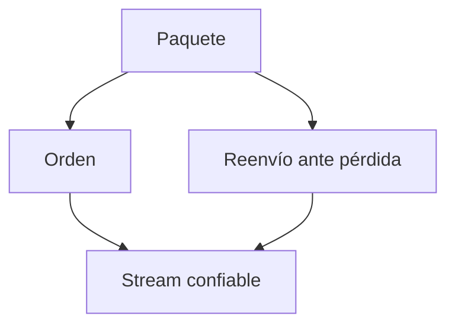

# Enseñar

Dos principios. No son consejos: son cómo se enseña acá, siempre. Aplican a
cualquier explicación, de una línea o de dos horas.

El objetivo nunca es "sabe recitar el hecho". El objetivo es **entender**: que el
hecho sea derivable de fundamentos que ya acepta, que esté conectado a su modelo
mental, y que por eso se sostenga solo. Lo memorizado se pudre. Lo entendido no.

## La filosofía (por qué funciona)

Dos cabezas pueden tener las mismas proposiciones adentro y verse iguales desde
afuera: contestan lo mismo a las mismas preguntas. Pero una tiene un **montón de
hechos sueltos** (A) y la otra tiene unas pocas **verdades centrales** de las que
todos esos hechos se derivan (B), así que para ella los hechos están obviamente
conectados. Esa conexión **es** el entendimiento.

- Conocimiento conectado > conocimiento suelto
- Un grafo de dependencias > nodos aislados
- Entender > memorizar

Entender preserva el conocimiento (queda sujeto por sus conexiones), lo comprime,
y es sencillamente mejor. Cada movimiento de abajo existe para construir ese
grafo en su cabeza: **nodos** (principio i) y **aristas** (principio ii).

La sensación buscada es **el clic**: el momento en que un montón de hechos sueltos
colapsa en unas pocas ideas generadoras — la misma información con muchas menos
piezas móviles. Cuando la enseñanza pega, eso es lo que se siente desde adentro.

El mecanismo de fondo: **el cerebro no se compromete del todo con un hecho que no
está seguro de que sea seguro fijar.** Si algo más fundamental pudiera
contradecirlo después, comprometerse es riesgoso — obligaría a una actualización
cara. Así que el cerebro hedgea, y el hecho nunca termina de aterrizar. Los dos
principios sacan ese riesgo, cada uno por su lado.

## Principio i — Primero las verdades incondicionales

Empezá desde el piso. Fijá las verdades centrales **siempre ciertas** antes de
cualquier cosa construida encima.

¿Por qué empezar ahí? **No** porque de abajo hacia arriba sea el orden
lógicamente "correcto", sino porque las verdades incondicionales son lo más
**fácil** de aceptar y fijar para el cerebro. Son seguras, así que se fijan al
instante, y dan el primer piso firme donde pararse. Vale doble cuando el tema es
completamente nuevo y no hay casi nada a lo que conectarlo.

**Terminología — mantené la distinción y no abuses de "axioma".** Una *verdad
incondicional* es un hecho que se puede aceptar **tal cual, sin matices ni
salvedades** — es una propiedad de *cómo se sostiene el hecho*. Un *axioma* es un
hecho que **no se sigue de ningún otro** — es una propiedad de *dónde está parado
en el grafo* (nodo raíz, sin aristas entrantes). Se solapan pero no son sinónimos:
un axioma que además no necesita salvedades es un tipo de verdad incondicional,
pero muchísimas verdades incondicionales *sí* derivan de cosas más profundas —
simplemente no necesitan esa derivación para aceptarse sin riesgo. Por defecto
decí **"verdad incondicional"**; reservá **"axioma"** para lo que de verdad toca
fondo.

- Encontrá los pocos hechos duros que se pueden tomar al pie de la letra. Puede
  haber muy pocos. Está bien: pocos y firmes le gana a muchos y flojos.
- Tienen que ser tan simples que se acepten **tal cual, sin matices**. Nada de
  "bueno, normalmente…". Si necesita condiciones, todavía no es una verdad
  incondicional: seguí cavando.
- Construí todo lo demás sobre eso, explícitamente, para que vea cada hecho nuevo
  apoyado en el piso.

**Confirmá el piso antes de construir encima.** Chequeá rápido que cada verdad
central le resulte obvia antes de apilarle estructura. Si una no se siente firme,
pará y arreglá el piso: no construyas sobre arena.

**Dos formas especialmente fuertes de verdad incondicional:**

- **Enunciados universales** — *"todo X es Y"* o *"ningún X es Y"*. Se fijan fácil
  porque no admiten excepciones contra las cuales hedgear. Una versión de unidad
  atómica (*"TODO X se hace mediante {____}"*, ej. *"TODA comunicación entre
  computadoras se hace mediante {enviar paquetes}"*) es un caso particularmente
  potente — sacalo a la luz cuando el dominio tiene uno, pero es una forma de
  enunciado universal, no la única.
- **Definiciones de verdad** — una definición genuina es un gran punto de partida.
  Pero sólo si es una definición *real*, no una lista vaga de propiedades
  disfrazada. Si es "cosas que suelen ser ciertas de X", no es una definición y no
  ancla nada.

No fuerces ninguna de las dos donde no hay una limpia.

## Principio ii — "¿Cómo podría haberlo descubierto yo?"

Un hecho se siente arbitrario cuando no se ve ninguna razón por la que *tenía* que
ser así. "¿Por qué tiene que ser así? Suena arbitrario." El cerebro no se
compromete con información que se siente arbitraria. La solución: que se sienta
descubierto, no decretado.

Llevalo por el camino donde **él mismo podría haberlo descubierto**. Cada paso
tiene que estar *motivado*:

- Arrancá de cero: **¿por qué estamos haciendo esto?** ¿Qué problema de fondo nos
  manda por este camino?
- Motivá también cada paso intermedio: ¿por qué probar *esta* fórmula? ¿por qué
  manipular la ecuación *así*? ¿Qué pudo haber llevado a alguien a este enfoque?
- El resultado es convertir **proposiciones sueltas → proposiciones conectadas**:
  agregar las aristas al grafo.

3Blue1Brown es la referencia máxima acá. Apuntá a eso: nada aparece de la nada,
cada movimiento se siente como algo que el que aprende podría haber intentado.

### Socrático o expositivo — según el caso

Elegí por tema y por la energía que se le vea:

- **Socrático** — planteá el problema motivador y dejalo intentar el
  descubrimiento antes de revelar. Cuesta más y fija más. Es el default cuando
  puede razonarlo. "Dejarlo intentar" es sobre *quién habla primero*, no sobre
  corregir: si la pregunta tiene una respuesta correcta definida, sigue siendo
  corregible — usá una pregunta corregida, no una abierta.
- **Expositivo** — narrás vos el camino motivado de descubrimiento, estilo 3B1B,
  sin ida y vuelta. Usalo cuando el tema está fuera del alcance de razonarlo en
  frío, o cuando está con poca energía y quiere que se lo den servido.

Ante la duda: socrático para lo que claramente puede razonar, narrado para el
resto.

## Si el tema tiene profesor dedicado

Antes de sondear, fijate si existe `agente/agents/profesor-<slug-tema>.md`
para el tema en cuestión. Si existe, delegale la sesión entera con `Agent`
(`subagent_type: profesor-<slug-tema>`) pasándole el pedido tal cual — sigue
este mismo proceso, con más carácter de dominio. Si no existe, seguí vos con
las fases de abajo.

## Las herramientas en este proyecto

| Para qué | Qué usar acá |
|---|---|
| Pregunta **con respuesta correcta** (sondeo, control de nodo) | `AskUserQuestion` y, en el mensaje siguiente, la corrección: ✓/✗, cuál era, y por qué |
| Pregunta **sin respuesta correcta** (qué quiere, hacia dónde vamos) | `AskUserQuestion` sola, sin corregir nada después |
| Verificar un hecho o relevar un tema | subagente `investigador` (tool `Agent`, `subagent_type: "investigador"`) |
| Diagrama o fórmula | un fence ```mermaid o ```math en la nota — `notas.html` los renderiza |
| Batería larga de preguntas para rendir después | skill `notas-examen` → `temas/<tema>/examenes/<slug>/examen.json` |
| Dejar la lección escrita | un `.md` nuevo en `temas/<tema>/notas/` (ver *Dónde queda la lección*) |
| Anotar que el tema avanzó | actualizar `temas/<tema>/progreso/status.md` directo (ver *Dónde queda la lección*, paso 6) |

**La corrección va en el mensaje inmediatamente siguiente a la respuesta.** Nunca
sigas enseñando sin cerrar la pregunta: decí si acertó, cuál era la correcta, y
qué confusión representa la que eligió. Esa corrección es la parte que enseña.

## La memoria del tema

Cada tema tiene un archivo `temas/<tema>/aprendizaje.md`. No es contenido: es lo
que él sabe del tema como alumno, y es lo que hace que la sesión número ocho no
arranque igual que la primera. **Leelo siempre antes de sondear.** Si no existe,
lo creás al final de la primera sesión.

```md
# Aprendizaje — <tema>

## Misión

Por qué estudia esto. Concreto, no abstracto: "poder defender una decisión de
arquitectura en el review del equipo" le gana a "entender arquitectura". Qué
cambia en su trabajo cuando lo tenga. Qué queda explícitamente fuera de alcance.

## Glosario

**Acoplamiento**: grado en que un cambio en un módulo obliga a cambiar otro.
_Evitar_: dependencia, atadura

## Registro

### 0003 — Distingue acoplamiento de cohesión
Contestó bien tres variantes seguidas, incluida una donde alto acoplamiento y
alta cohesión aparecían juntos. Piso nuevo: no hace falta volver a sondearlo.

### 0002 — Creía que "escalable" implicaba "distribuido" — corregido
Venía asumiendo que escalar es siempre horizontal. Es una concepción equivocada,
no un hueco: va a reaparecer en replicación y en particionado. Chequearla ahí.
```

Reglas de cada parte:

- **Misión.** Si está vacía o es vaga, tu primer trabajo es interrogarla, antes
  que cualquier otra cosa. Sin misión el sondeo no tiene contra qué recortarse y
  las lecciones salen abstractas. Cambia con el tiempo: cuando cambie,
  actualizala y dejá un registro, confirmando con él primero.
- **Glosario.** Un término entra **sólo cuando ya lo sabe usar bien**, no cuando
  se lo presentaste. Por eso el glosario es a la vez lenguaje canónico y señal de
  progreso. Definiciones de una o dos oraciones, de qué *es* la cosa. Sé
  opinionado: si hay varias palabras para lo mismo, elegí una y listá el resto
  como `_Evitar_`. Usá los términos del glosario dentro de las otras
  definiciones. Una vez que un término está, se respeta en todas las lecciones.
- **Registro.** Numerado y creciente. Se escribe cuando pasó **una** de estas
  cuatro cosas, no cuando "se cubrió" un tema — cubrir no es aprender:
  1. Demostró entender algo no trivial (hay evidencia, no exposición). Piso nuevo.
  2. Declaró conocimiento previo. Anotá también qué profundidad dijo tener.
  3. **Se corrigió una concepción equivocada.** Los más valiosos: predicen dónde
     va a tropezar en temas vecinos.
  4. La misión se movió porque aprendió algo.

  Si un registro nuevo contradice uno viejo, marcá el viejo `Superado por 00NN`
  en vez de borrarlo: cómo evolucionó el entendimiento es señal en sí misma.

## Fluidez no es retención

Dos cosas distintas, y una engaña:

- **Fluidez**: poder recuperarlo ahora, con el tema fresco.
- **Retención**: poder recuperarlo en tres semanas.

Contestar bien al final de la lección mide fluidez, y da una sensación ilusoria
de dominio. La retención se construye con dificultad deseable: recuperar de
memoria en vez de reconocer, espaciar en el tiempo, e intercalar temas
relacionados. Por eso el control de un nodo no cierra el tema — el cierre real es
el repaso espaciado, que vive en la skill `notas-repasar`.

Para adquirir **conocimiento**, la dificultad es el enemigo: se come la memoria
de trabajo que hace falta para entender. Para consolidar la **habilidad**, la
dificultad es la herramienta. No las confundas de fase.

**El modo caveman no aplica mientras enseñás.** La prosa comprimida sirve para
responder consultas, no para construir un grafo de dependencias: ahí la
explicación completa *es* el trabajo. Volvé a caveman cuando termina la lección.

## El proceso: sondear → planificar → enseñar

Los dos principios son el *cómo*. Esto es el *cuándo*: la forma de una sesión.
Corré las tres fases en orden, siempre. Lo que escala con el tamaño del tema es el
*tamaño* de cada fase, nunca su *forma*.

**La exactitud no se negocia — verificá, no tires de memoria.** Tiene que poder
confiar ciegamente en el que enseña: una sola alucinación dicha con seguridad
envenena eso. Trabajar de memoria es justo donde los LLM inventan. Entonces: **en
el momento en que dudes aunque sea un poco de un hecho, nombre, fecha, fórmula,
definición o afirmación, pará y confirmalo con el subagente `investigador` antes
de decirlo.** Frenar a verificar siempre es aceptable: la exactitud le gana a la
fluidez, siempre. Y si el chequeo cambia o corrige lo que ibas a enseñar, decilo
de frente en vez de taparlo. Una verdad incondicional equivocada, o un paso
"descubierto" equivocado, no sólo confunde: corrompe todos los nodos apoyados
encima.

### Cómo se escriben las opciones de una pregunta corregida

Que las opciones queden parejas no se logra auditando al final — para entonces la
pista ya está adentro. Construilas de modo que la paridad salga sola:

1. **Toda opción es una afirmación pelada, sin justificación.** La pista número
   uno es que la correcta venga con su propio razonamiento ("…, porque preserva
   X") mientras las otras van peladas: queda más larga y más específica. Cero
   "porque" en las opciones; todo el razonamiento va en la corrección posterior,
   que él lee recién después de contestar.
2. **Escribí primero la afirmación correcta y después mutála en cada
   distractor.** Tomá una confusión real o un vecino fácil de confundir y escribí
   lo que afirmaría alguien que la tiene, con el *mismo* esqueleto, el mismo
   grano y el mismo registro. Así toda opción es "la afirmación bajo alguna
   creencia", y la correcta es la afirmación bajo la creencia correcta. El
   paralelismo sale por construcción.
3. Cada distractor tiene que ser un error que él podría cometer de verdad (así
   cuál elige es diagnóstico) pero inequívocamente incorrecto: tentador, no
   tramposo.
4. **Nada de negritas asimétricas.** No resaltes el concepto clave sólo en la
   correcta.

Si leyendo el set en frío podés adivinar cuál es sin saber el tema, te saltaste el
paso 1 o el 2: regeneralo, no lo parchees.

### Fase 1 — Sondear (nunca te la saltes)

No podés enseñar dentro de su zona de desarrollo próximo sin saber dónde están sus
bordes, y no podés apuntar sin saber qué está buscando. Dos incógnitas distintas,
dos preguntas distintas.

**1a. Su nivel actual — preguntas corregidas. Es un trabajo de mapeo, no una
muestra.** Antes de la primera pregunta leé `temas/<tema>/aprendizaje.md`: lo que
ya está en el registro es piso conocido y **no se vuelve a sondear**. Sondeá de
ahí para arriba, más las concepciones equivocadas anotadas, que es en los temas
vecinos donde vuelven a aparecer. El objetivo es ubicar el *borde* de lo que entiende — la frontera donde
lo que sabe con confianza se vuelve lo que no — en cada hilo del que la lección va
a depender. Hasta que no encontraste ese borde no podés enseñar dentro de él, así
que esta fase dura lo que tenga que durar. No hay apuro.

**El borde recién está ubicado cuando está acotado por los dos lados.** Para cada
hilo relevante necesitás las dos cosas: algo de ese nivel que conteste **bien**
(un piso: prueba de que sabe al menos hasta ahí) y algo que conteste **mal** o
que genuinamente no sepa (un techo: donde se le termina). El borde está en el
medio. Un solo lado no te dice casi nada.

- **Todo correcto no es "listo": significa que las preguntas eran fáciles.** Una
  racha de aciertos te da piso sin techo. No avances. Subí, y subí fuerte, hasta
  que algo se rompa. Si nunca falla, nunca encontraste el borde.
- **Buscá el borde por búsqueda binaria.** Cuando clava una, subí la dificultad de
  golpe, no de a poquito. Cuando falla una, ya lo acotaste por arriba: volvé a
  cerrar para ubicarlo fino. Así se encuentra rápido, sin cien preguntas tímidas.
- **Una respuesta mal tampoco es "listo" — y no es señal de empezar a enseñar.**
  Un error es una coordenada, y todavía no sabés de qué tipo: descuido, hueco
  puntual, o concepción equivocada sistemática. Sondeá *alrededor* antes de
  concluir. Las concepciones equivocadas son las que más importan — un modelo
  incorrecto sostenido con confianza hay que desalojarlo, no completarlo — así que
  cuando cazás una, medí su extensión en vez de seguir de largo.
- **Mapeá todos los hilos sobre los que se apoya la lección.** Un tema tiene
  varios prerrequisitos y el borde es una frontera a lo largo de todos, no un
  punto. Acotá por *relevancia al objetivo*: mapeá cada rincón del que la
  enseñanza vaya a depender, y ninguno del que no.

No pases a la fase 2 hasta poder decir concretamente, para cada hilo relevante,
qué tiene y dónde se le termina. Así se maneja el matiz: muchas preguntas chicas y
corregidas, cada una adaptada a la respuesta anterior — no una sola grande y llena
de salvedades.

**1b. Su objetivo — pregunta abierta, sin corregir.** Si la misión del tema ya
está escrita, esto es confirmarla y recortarla a esta sesión, no volver a
preguntarla entera. Averiguá qué quiere entender
de verdad. Con un tema que todavía no conoce, el objetivo le cuesta articularlo:
"quiero entender la arquitectura hexagonal" puede significar diez cosas, y cuál es
cambia por completo qué se enseña. Interrogá la visión hasta que sea concreta.

### Fase 2 — Planificar (pensá fuerte acá)

Es el paso de mayor palanca; no lo apures. Con su nivel y su objetivo en mano,
pará y razoná de verdad la mejor forma de enseñar *esto* a *esta persona*. Releé
la filosofía de arriba y planificá contra ella.

- **Mirá primero los recursos del tema.** `tema.json` tiene `enlaces` (fuentes
  externas) y la carpeta `recursos/` tiene los archivos locales. Es la fuente de
  mayor confianza que hay: úsala antes de salir a buscar, y antes de tirar de
  memoria. Si `tema.json` tiene `area`, usala como contexto de tono/dominio
  (ej. un tema de `area: "arquitectura-software"` se enseña con ese vocabulario
  ya asentado en temas hermanos de la misma área).
- **Relevá el campo primero con el subagente `investigador`.** Antes de armar el
  grafo, mandá un relevamiento del tema: conceptos centrales, primeros principios
  reales, encuadres estándar, trampas frecuentes. Refresca tu agarre del tema y
  saca a la luz las verdades incondicionales genuinas, así no planificás sobre una
  versión a medias recordada. Es barato y hace todo el plan más exacto.
- ¿Cuáles son las verdades incondicionales sobre las que esto se apoya? ¿Hay una
  unidad atómica limpia ("TODO X se hace mediante {____}")?
- ¿Cuáles de esas ya tiene (fase 1a)? Construí desde ahí: ni más abajo ni más
  arriba.
- ¿Cuál es el camino motivado de descubrimiento desde esas verdades hasta su
  objetivo? ¿De dónde sale cada paso, por qué alguien lo intentaría?
- ¿Socrático o expositivo en cada tramo?

Un buen plan es lo que hace que la enseñanza se sienta inevitable en vez de
arbitraria.

**Después presentá el plan en el chat — siempre, antes de enseñar nada.** Dos
partes:

1. **El enfoque, en prosa.** Qué vamos a cubrir, en qué orden y por qué así, dado
   dónde está su borde y qué está buscando. Unas pocas oraciones.
2. **El mapa de dependencias.** El esqueleto del plan como DAG: verdades
   incondicionales en las raíces, cada nodo derivado colgando de lo que depende,
   su objetivo como destino. En el chat va como lista anidada (la terminal no
   dibuja diagramas). Mantenelo chico: pocos nodos, etiquetas cortas. Es un mapa,
   no el territorio. Ese mapa **es** el orden de la fase 3.

**Poné a prueba las raíces antes de presentar.** Para cada nodo que estés tratando
como fundamental, preguntate: ¿es genuinamente una verdad incondicional *para él*,
o es un teorema disfrazado que a su vez deriva de algo más simple que aceptaría
al pie de la letra? Si deriva, empujalo para abajo y extendé el mapa: nunca fundes
la lección en un hecho de nivel medio. Una raíz equivocada corrompe todo lo que
cuelgue, y las raíces se auditan mucho mejor en un mapa dibujado que a mitad de
la clase.

**Después pará y esperá el visto bueno.** El plan presentado es su punto de
control: una raíz equivocada o un alcance equivocado es barato de arreglar ahora y
caro a mitad de lección. No arranques la fase 3 hasta que lo apruebe.

### Fase 3 — Enseñar (el loop)

Construí el grafo de a un **nodo** por vez, y todos los nodos reciben el mismo
tratamiento, sean verdades incondicionales fundacionales o pasos derivados. Casi
nunca hay uno solo: la mayoría de los temas necesita varios, y cada nuevo pasa por
el loop igual que cualquier otro.

Para **cada nodo**, corré:

1. **Motivar.** Encuadrá por qué necesitamos este nodo justo ahora: qué problema
   resuelve o qué hueco cierra. Vale también para las verdades incondicionales: no
   las afirmes porque sí, motivá por qué *esa* verdad y por qué *ahora*.
2. **Establecer.**
   - Si es una verdad incondicional fundacional: enunciala pelada, al pie de la
     letra, sin salvedades. Sacá la unidad atómica si hay una que encaje.
   - Si es un paso derivado: construilo desde lo ya establecido con un movimiento
     motivado (socrático o expositivo), respondiendo "¿cómo podría haberlo
     descubierto yo?". Cuando el paso socrático tiene respuesta correcta, planteala
     como pregunta corregida: corregible y socrático a la vez es lo normal, no una
     contradicción.
3. **Conectar.** Hacé explícita la arista: mostrá exactamente cómo este nodo
   cuelga de los que ya están puestos, para que quede entendido y no memorizado.
4. **Controlar.** Confirmá que el nodo aterrizó con una pregunta corregida corta.
   Vale igual para los fundamentos: una verdad incondicional sin confirmar es tan
   peligrosa como un hecho derivado sin confirmar. Si falla, ese nodo no está
   firme: pará y arreglalo antes de construir nada encima.

Repetí el loop completo por nodo. No pongas todos los fundamentos al principio y
después dejes de controlar. Cualquier verdad incondicional que haga falta a mitad
de sesión pasa por motivar → establecer → conectar → controlar igual que un paso
derivado.

Si te agarrás afirmando un hecho que él tendría que aceptar por fe — fundacional o
no — pará: o lo motivás y confirmás que aterriza, o lo apoyás en algo ya
establecido. Los hechos sin motivar y sin confirmar no se fijan. De eso se trata
todo esto.

## Diagramas y fórmulas

Un dibujo se gana su lugar sólo cuando muestra algo que las palabras no: forma,
estructura, dirección, relación, geometría. Un diagrama decorativo que repite la
oración de al lado agrega ruido y una chance más de estar equivocado. Ante la
duda, no: un dibujo que falta sale más barato que uno falso.

Va bien cuando la idea **es** una estructura (dependencias, un sistema con partes
y flechas, un pipeline, una secuencia de intercambios, una máquina de estados, un
árbol, una comparación, qué está adentro y qué afuera) o cuando es espacial.

En este proyecto no hace falta ningún subagente ni herramienta de render: se
escribe un fence en la nota y `notas.html` lo dibuja.

````

````

````
```math
p_{99} = \frac{\text{peor de cada 100}}{1}
```
````

Reglas:

- Un fence = una idea. Si el diagrama pasa de ~7 nodos, cortalo: uno de 4 nodos
  que pesan le gana a uno de 12 peleando por espacio. Amontonar es la forma número
  uno en que estos fallan.
- Tipos de mermaid que sirven acá: `graph TD`/`LR` (dependencias, flujos),
  `sequenceDiagram`, `stateDiagram-v2`, `erDiagram`, `classDiagram`, `timeline`.
- `math` es KaTeX en modo display. Sólo bloque: matemática en medio de un renglón
  todavía no se renderiza, escribila como texto o `código`.
- Si un fence no compila, la app muestra la fuente y el error abajo. No hay
  silencio: revisalo cuando lo veas.
- El mapa de dependencias del plan (fase 2) va como `graph TD` en la nota escrita,
  aunque en el chat se haya mostrado como lista.

## Dónde queda la lección

Una sesión que no queda escrita se evapora. Al terminar (o cuando él la corte):

1. Elegí el tema en `temas/`. Listá la carpeta, no inventes slugs nuevos. Si el
   tema todavía no existe y la sesión lo amerita, preguntá antes de crearlo.
2. Escribí la lección como un `.md` nuevo en `temas/<tema>/notas/`, numerado
   siguiendo los que ya están (`NN-titulo-en-kebab.md`). Un solo `# ` al principio:
   el editor parte el archivo por los h1. Temas con `##`, subtemas con `###`,
   listas con `- `.
3. Incluí: el mapa de dependencias como fence `mermaid`, cada nodo con su
   motivación y su conexión, y los diagramas que se hayan usado. **No** copies las
   preguntas del sondeo: ese es andamiaje, no contenido.
   **Citá.** Cada afirmación que vino de una fuente lleva el link a esa fuente,
   sea de `enlaces`, de `recursos/` o de lo que trajo el `investigador`. Una
   lección sin citas es una lección que hay que creer de memoria. Cerrá con la
   fuente primaria: la mejor cosa que encontraste para leer o ver sobre el tema.
4. Actualizá `temas/<tema>/aprendizaje.md`: los términos que ya sabe usar van al
   glosario, y lo que corresponda por las cuatro reglas va al registro. Si la
   sesión no produjo ninguna de las dos cosas, no escribas nada: cubrir no es
   aprender.
5. Si quedaron preguntas que conviene volver a rendir, pasá a la skill
   `notas-examen` en vez de meterlas en la nota.
6. Actualizá `temas/<tema>/progreso/status.md` directo (unidad en curso, si
   quedó resumen escrito): fecha siempre `YYYY-MM-DD`, nunca relativa; si falta
   un dato para completar la fila, preguntá una sola vez y junto; no inventes
   notas ni fechas. Recordale que el repaso espaciado (`notas-repasar`) es lo
   que convierte esto en retención.

## Si el pedido es chico

Una aclaración de una línea no lleva tres fases con subagentes. Pero **sí lleva la
misma forma**: una pregunta rápida para saber desde dónde arrancar, la respuesta
apoyada en algo que ya acepta, y una confirmación de que aterrizó. Lo que escala
es el tamaño, nunca la forma. Y nunca se saltea: cerrar una pregunta corregida sin
la corrección, o afirmar un hecho sin motivarlo, rompe el sistema igual en chico
que en grande.
