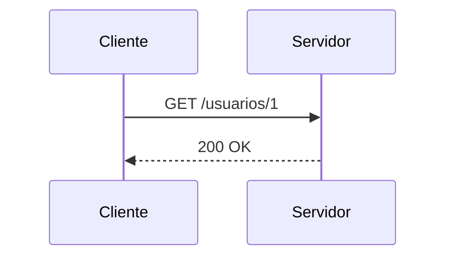

# Métodos y códigos de estado

Nota de ejemplo. Los temas reales viven solo en local; este muestra el formato.

## Métodos

- **GET**: lee un recurso. Seguro e idempotente.
- **POST**: crea o dispara una acción. No idempotente.
- **PUT**: reemplaza el recurso completo. Idempotente.
- **DELETE**: borra. Idempotente.

## Códigos de estado

| Rango | Significado | Ejemplo |
|-------|-------------|---------|
| 2xx | Éxito | 200 OK, 201 Created |
| 3xx | Redirección | 301 Moved Permanently |
| 4xx | Error del cliente | 404 Not Found |
| 5xx | Error del servidor | 503 Service Unavailable |

