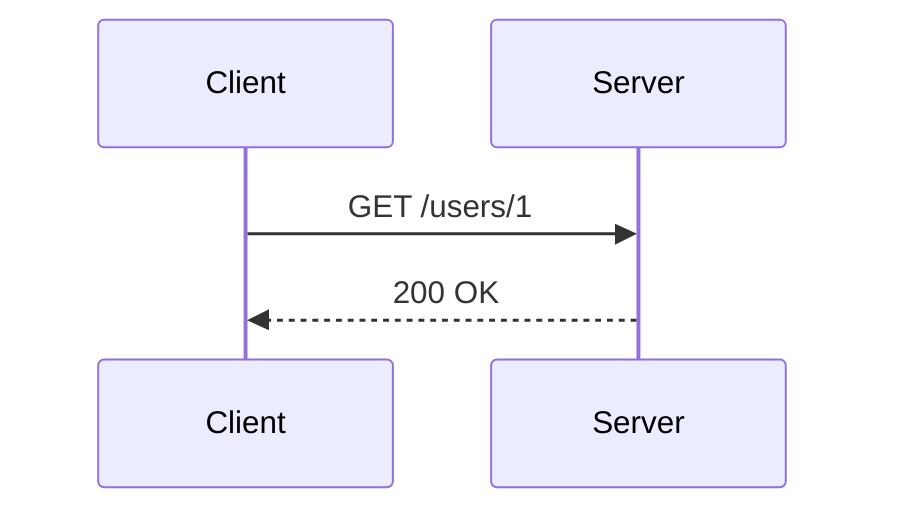

# Methods and status codes

Example note. Real topics live only on your machine; this one shows the format.

## Methods

- **GET**: reads a resource. Safe and idempotent.
- **POST**: creates something or triggers an action. Not idempotent.
- **PUT**: replaces the whole resource. Idempotent.
- **DELETE**: deletes. Idempotent.

## Status codes

| Range | Meaning | Example |
|-------|---------|---------|
| 2xx | Success | 200 OK, 201 Created |
| 3xx | Redirection | 301 Moved Permanently |
| 4xx | Client error | 404 Not Found |
| 5xx | Server error | 503 Service Unavailable |

